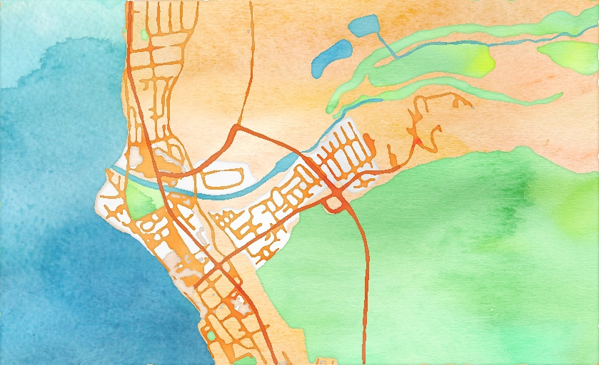

# OsmArtRenderer

An experimental and learning project for rendering OSM data with some nice effects.
The first effect I tried to implement was a kind of watercolor effect. See details below.
Another effect is inspired by Piet Mondrien. And finally just black and white.

The - especially the OpenGL / GLSL part - is not really well optimized. There is a lot of space for improvement. For example, I copy the texture back and forth between GPU and CPU for every single step of the algorithm. The textures could instead be kept on the GPU and used from there (somehow...).

## Watercolor effect:
One of the challanges was to create polygons for the landsmass and ocean so that I can render them independently with different textures.
I developed an algorithm that turns coastlines into polygons. The algorithm is inspired by this [presentation](https://monarch.qucosa.de/api/qucosa%3A19708/attachment/ATT-0/) (in German only) and this [description](https://hi.stamen.com/watercolor-process-3dd5135861fe).\
You can find my document with my considerartions [here](./Osm%20Renderer%20Ocean%20Polygons.pdf) (sorry, but some notes are in German).

### Algorithm sketch:
For each layer of the OSM data (buildings, highways, greenland, etc.) bascially do this:\
1) Render the osm data for that layer in black on white background
2) Blur the result of 1)
3) Overlay the result of 2) with a noise texture to create "wobbly" shape outlines. With watercolor you also have these lines when you apply the watercolor to paper.
4) Now overlay result of 3) with the watercolor texture (e.g. brown for buildings)
Now I want to create a darker area towards the boundaries of the shapes.
5) Invert the result of 3) (now it's white on black background)
6) Blur the result of 5) (now you have a gradient within the layer shapes)
7) Mask result of 5) with 6) to just get the blurred outlines within the shapes
8) Combine result of 4) with 7) to get the watercolor effect texture for the layer
9) In the end combine all results of 8) from all layers to one final composition

You can play with the alpha values when combining / blending, with the noise texture and with other shader parameters, too.

### Some examples of the final rendering:
#### Monterey with one coastline

#### Monterey with u-shape coastline

#### Monterey with two coastlines

#### Lahaina

#### Santa Cruz

#### Munich

#### Olching

## Piet Mondrien:
TBD
### Example renderings:
#### Munich

